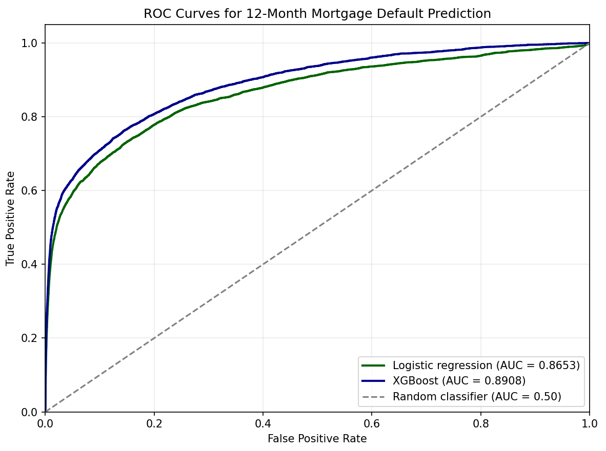

# Mortgage Default Predictor

This script trains an XGBoost model to predict whether a mortgage loan will become seriously delinquent (`dq >= 3`) within the next 12 months.

## What it does

* Reads the most recent 20 CSV files from `Performance_All.zip`
* Samples loans to reduce the dataset size
* Cleans the monthly performance data
* Creates basic loan and delinquency-history features
* Builds a 12-month default target
* Splits the data into train/test periods by date
* Trains an XGBoost classifier
* Reports AUC, Accuracy Ratio, and feature importance

## Requirements

```bash
pip install numpy pandas scikit-learn xgboost
```

## Data

Update the ZIP file location in the script:

```python
ZIP_PATH = r"C:\path\to\Performance_All.zip"
```

The script expects the performance files to use `|` as the delimiter and the standard field layout used by the source data.

## Sampling

`SAMPLE_MOD` controls how much of the data is sampled.

```python
SAMPLE_MOD = 250
```

A loan is included when the last six digits of its loan ID are divisible by `SAMPLE_MOD`.

Lower values produce a larger sample.

## Target

The target is `1` if the loan reaches `dq >= 3` within 12 months of the observation date.

Observations that are already seriously delinquent are excluded. The final 12 months of the dataset are also excluded because a full 12-month outcome period is not available.

## Features

The model currently uses:

* Original and current interest rates
* Current and original UPB
* Original term
* LTV / CLTV
* DTI
* FICO
* Current delinquency
* Loan age
* Rate change
* Balance ratio
* 6-, 12-, and 24-month delinquency history summaries

The categorical variables in the source data are currently not used.

## Train / Test Split

The split is based on time rather than randomly.

The test period starts at the 75th percentile of the observation dates. Training data ends 12 months before that date.

Missing numeric values are filled using medians calculated from the training set.

## Model

The model is an `XGBClassifier` with the parameters defined in the script.

The main evaluation metric is ROC AUC. Accuracy Ratio is calculated as:

```text
Accuracy Ratio = 2 × AUC - 1
```

The script also prints the 20 most important features according to the model.

## Output

Example output:

```text
Sampled observations: 4646063
Train observations: 1969796
Test observations: 1280319
Test default rate: 0.00936
AUC: 0.8908
Accuracy Ratio: 0.7816

Top 20 feature importances:
hist_max_6m           0.436771
dq                    0.209807
hist_max_12m          0.192984
hist_max_24m          0.030939
hist_months_30plus    0.028780
fico                  0.023893
current_rate          0.010674
orig_term             0.008476
dti                   0.008138
orig_ltv              0.008012
orig_cltv             0.007876
orig_rate             0.006371
orig_upb              0.006340
current_upb           0.006290
balance_ratio         0.006030
hist_months_60plus    0.003835
age_months            0.003116
hist_months_90plus    0.001669
rate_change           0.000000
```



## Notes

This is currently a baseline/research model. The categorical variables and individual monthly history fields are available in the dataset but are commented out of the feature set.

For larger-scale testing, `SAMPLE_MOD` can be reduced or the sampling step can be removed.
